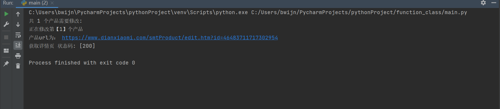

### 读取json的步骤必须要str()

### 格式化为字符串！！！！

*使用前 复制add.json form表单 到 form_data_handle*

> 更换上货用户之前：
> 1. 更换header conf:
> 2. 改post_form:
> 3. 更换自定义价格 (sku_template.json)
   在全局设立文件名
> 4. processing_product.py 处理，提取新产品标题等重要信息，并返回

-----------------

